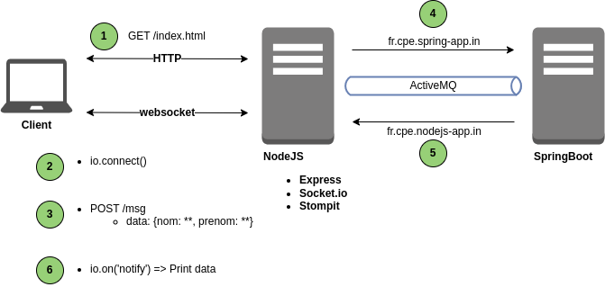

## TP

Le but du TP est de mixer les différentes technologies vues jusqu'à maintenant.

Un client communiquera via Socket.io et en REST avec un serveur NodeJS, qui communiquera lui-même avec une application SpringBoot à travers un broker ActiveMQ.

### Workflow



1. Un client demande au serveur NodeJS l'index.html qui contient un mini-formulaire.
2. La connexion au serveur de websocket (socket.io) est établie automatiquement au chargement de la page.
3. A la validation du mini-formulaire, on evoie un POST sur `/msg` avec un JSON `{nom: **, prenom: **}`
   - Le serveur NodeJS expose un endpoint `/msg` en POST

4. Le serveur NodeJS dépose le JSON reçu sur la queue `fr.cpe.spring-app.in` qui est écoutée par l'application SpringBoot
5. L'application SpringBoot enrichit l'objet reçu (en ajoutant un champs) et le dépose sur la queue `fr.cpe.nodejs-app.in` qui est écoutée par l'application NodeJS.
6. L'application NodeJS enrichit le JSON reçu et l'envoi via socket.io, en émettant l'évenement `notify` à toutes les sockets connectées.
    - Les clients qui reçoivent l'évenement affichent les données sur la page.

### Etapes

- Démarrer ActiveMQ
- Initialiser un nouveau projet npm
- Ajouter les dépendances `express`, `socket.io` et `stompit`
- Créer un serveur HTTP avec express qui sert le contenu statique contenu dans un répertoire.
- Créer le endpoint `/msg` en POST qui log les données reçues
- Créer un fichier `index.html` qui contient 2 champs texte (`nom` et `prenom`) et un bouton de validation
- Ajouter socket.io à votre serveur
- Ajouter le client Socket.io au fichier `index.html` et connecter le client au serveur au chargement de la page.
- Au clic sur le bouton de la page, appeler `/msg` en POST avec un objet ```{nom: **, prenom: **}```
- Sur le serveur NodeJS, utiliser stompit pour déposer l'objet précédemment reçu sur une queue `fr.cpe.spring-app.in` dans activemq
- Développer une application SpringBoot qui écoute la queue `fr.cpe.spring-app.in` et qui ajoute la propriété `spring: "OK"` à votre objet
- Déposer cet objet sur une queue `fr.cpe.nodejs-app.in` dans activemq
- Ajouter un listener sur la queue `fr.cpe.nodejs-app.in` en utilisant stompit dans votre application NodeJs, et ajouter la propriété `node: OK` à votre objet
- Envoyé cet objet à votre client par socket.io et afficher cette objet sur la page html.

### Elements fournis:

- L'application SpringBoot est fournie, avec des TODO à compléter
- Le fichier index.html est fourni, mais pas le javascript associé (cf. ligne18 - '/js/index.js')
